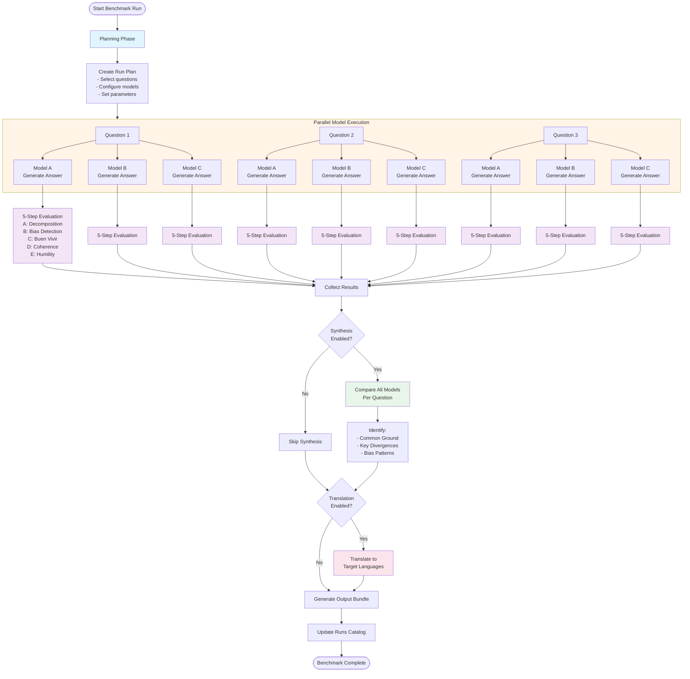
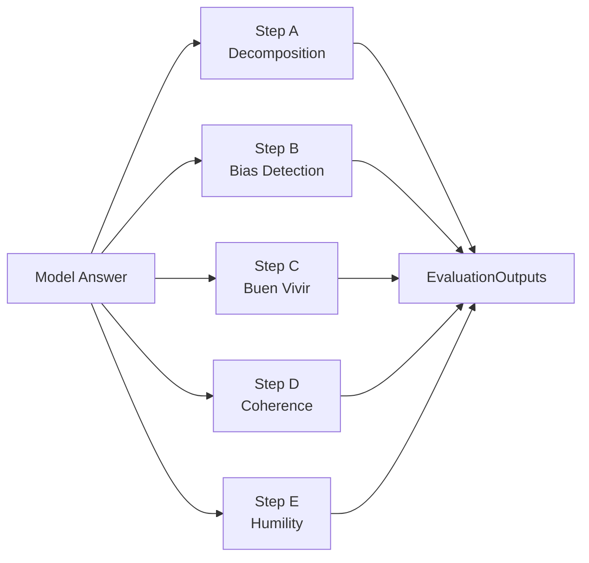
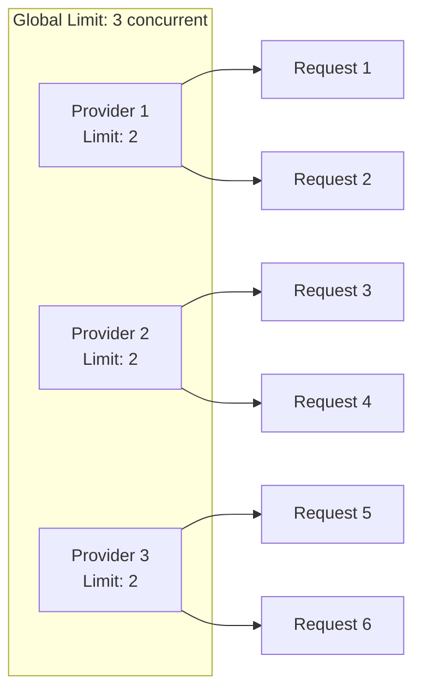

# Wellness-Bench Architecture Documentation

## Overview

Wellness-Bench is a sophisticated benchmarking system designed to evaluate Large Language Models (LLMs) on complex wellness-related questions. The system assesses model responses across multiple dimensions including bias detection, coherence, cultural alignment, and epistemic humility.

## Table of Contents

1. [Quickstart Guide](#quickstart-guide)
2. [System Architecture](#system-architecture)
3. [Benchmark Pipeline Flow](#benchmark-pipeline-flow)
4. [Key Components](#key-components)
5. [Model Execution](#model-execution)
6. [Evaluation Framework](#evaluation-framework)
7. [Synthesis and Analysis](#synthesis-and-analysis)
8. [Output Structure](#output-structure)
9. [Configuration](#configuration)
10. [Configuration Decision Guide](#configuration-decision-guide)
11. [Development Workflow](#development-workflow)
12. [Concurrency and Reliability](#concurrency-and-reliability)
13. [Running Benchmarks](#running-benchmarks)
14. [Troubleshooting](#troubleshooting)
15. [Glossary](#glossary)

---

## Quickstart Guide

Get started with Wellness-Bench in under 5 minutes.

### Prerequisites

- Node.js 18+ and pnpm installed
- API keys for at least one LLM provider
- Git (for version tracking)

### Step 1: Setup Environment

```bash
# Clone or navigate to the project
cd wellness-bench

# Copy environment template
cp .env.example .env

# Add your API keys to .env
OPENAI_API_KEY=sk-...
ANTHROPIC_API_KEY=sk-ant-...
# Add other provider keys as needed
```

### Step 2: Install Dependencies

```bash
pnpm install
```

### Step 3: Run Your First Benchmark

```bash
# Run with minimal configuration (fastest way to see it in action)
pnpm run benchmark --questions q1-diagnosis --providers openai

# Results will be saved in: benchmarks/results/run-YYYYMMDD-HHMMSS-xxxxx/
```

**What happens during the run:**
1. Loads your selected question(s) and provider model(s)
2. Generates answers using the selected model(s)
3. Runs 5-step evaluation on each answer
4. Generates cross-model synthesis (if multiple models)
5. Saves structured results as JSON files

### Step 4: View Results

**Option A: Examine JSON Files**
```bash
# Navigate to latest run
cd benchmarks/results/run-<latest>/

# View aggregated results per question
cat per_question/q1-diagnosis.json

# View detailed results for specific model
cat per_model/q1-diagnosis/openai__gpt-4.json
```

**Option B: Use the Web UI** (if available)
```bash
# Start the development server
pnpm run dev

# Open browser to: http://localhost:3000
# Select your run from the dropdown
```

### Next Steps

**Customize Questions:**
```bash
# Edit questions configuration
nano benchmarks/config/questions.json

# Run with custom selection
pnpm run benchmark --questions q1-diagnosis,q2-causality
```

**Add More Providers:**
```bash
# Edit provider configuration
nano benchmarks/config/providers.json

# Add API keys to .env
echo "GOOGLE_API_KEY=..." >> .env

# Run multi-provider comparison
pnpm run benchmark --providers openai,anthropic,google
```

**Adjust Parameters:**
```bash
# Edit run configuration
nano benchmarks/config/run_config.json

# Modify:
# - temperature (creativity)
# - max_tokens (response length)
# - concurrency (speed vs rate limits)
```

**Understand Results:**
- See [Evaluation Framework](#evaluation-framework) for scoring details
- See [Output Structure](#output-structure) for file format reference
- See [Configuration](#configuration) for all available options

---

## System Architecture

The benchmark system follows a **sequential pipeline architecture** with five main stages:



---

## Benchmark Pipeline Flow

### 1. Planning Phase

**Location:** `benchmarks/scripts/run-planner.ts`

The planning phase resolves what will be benchmarked:

- **Question Selection**: Filters questions based on:
  - Enabled/disabled status
  - Domain filters
  - Specific question IDs
  - Tag-based selection

- **Provider/Model Selection**: Determines which models to test:
  - Provider availability (API keys present)
  - Enabled/disabled status
  - Specific model filters

- **Parameter Configuration**: Sets generation and evaluation parameters
- **Output Preparation**: Creates the run directory and initializes metadata

**Output:** A `RunPlan` object containing all configuration and selections.

### 2. Pipeline Execution

**Location:** `benchmarks/scripts/pipeline.ts`
**Key Function:** `runPipeline()`

The pipeline orchestrates the entire benchmark process:

#### Stage 1: Parallel Model Execution

Each model processes each question **independently and in parallel** (subject to rate limits).

```
For each question:
  For each model:
    - Generate answer
    - Run 5 evaluation steps
    - Track metadata
```

**Key characteristics:**
- **No cross-model communication** during generation
- **Independent API calls** per model
- **Parallel processing** with concurrency controls
- **Individual retry logic** per request

#### Stage 2: Synthesis Generation (Optional)

If synthesis is enabled and ≥2 models successfully answered a question:

1. Collect all model answers for that question
2. Send to synthesis model (can be different from evaluated models)
3. Generate comparative analysis identifying:
   - Common ground points across all models
   - Key divergences in approaches
   - Salient bias patterns

#### Stage 3: Translation (Optional)

If translation is enabled:

1. Translate syntheses to target languages
2. Rate-limited to prevent overwhelming APIs
3. Graceful degradation (keeps original text on failure)

### 3. Output Generation

**Location:** `benchmarks/scripts/output-generator.ts`

Creates the final structured output files:

- Per-question aggregated results
- Per-model detailed results
- Index and metadata files
- Updates the runs catalog

---

## Key Components

### 1. Provider Adapters

**Base Interface:** `benchmarks/providers/base.ts`

Provider adapters abstract the differences between various LLM APIs:

**Supported Providers:**
- **OpenAI** (`providers/openai.ts`)
- **Anthropic** (`providers/anthropic.ts`)
- **Google** (`providers/google.ts`)
- **Grok** (`providers/grok.ts`)
- **DeepSeek** (`providers/deepseek.ts`)
- **OpenRouter** (`providers/openrouter.ts`)

**Common Interface:**
```typescript
interface ProviderAdapter {
  complete(request: CompletionRequest): Promise<CompletionResponse>
  isAvailable(): boolean
  getApiKey(): string | undefined
}
```

**Responsibilities:**
- API communication and authentication
- Request formatting and response parsing
- Error handling and retry logic
- Rate limiting per provider
- Token usage tracking

### 2. Configuration Files

All configuration is centralized in JSON files:

#### `config/run_config.json`
```json
{
  "run_name": "Default Benchmark Run",
  "default_language": "en",
  "enabled_languages": ["en", "pt-BR"],
  "generation_params": {
    "temperature": 0.7,
    "max_tokens": 4096
  },
  "evaluation_params": {
    "temperature": 0.3,
    "max_tokens": 2000
  },
  "concurrency": {
    "max_concurrent_requests": 3,
    "per_provider_limit": 2
  }
}
```

#### `config/providers.json`
Defines all available providers and their models:
- Provider endpoints and authentication
- Model configurations
- Default parameters per model
- Enable/disable flags

#### `config/questions.json`
Contains benchmark questions:
- Question text and metadata
- Domain classification
- Ordering and tags
- Enable/disable flags

#### `config/eval_prompts.json`
Defines evaluation framework:
- Answer wrapper prompt
- Synthesis prompt template
- Translation prompt template
- Five evaluation step prompts
- Bias taxonomy definitions

---

## Model Execution

### Individual Model Execution

Each model is executed **separately** with the following flow:

```typescript
// From pipeline.ts (runPipeline function)
async function executeModel() {
  // Step 1: Generate answer
  const genResult = await generateAnswer(
    adapter,
    model.model_id,
    question.text,
    evalPrompts.answer_wrapper_prompt,
    model.params,
    retryOptions
  );

  // Step 2: Run evaluations (can use different evaluator model)
  const evalResult = await runAllEvaluations(
    evaluatorAdapter,
    evaluatorModelId,
    genResult.content,
    evalPrompts,
    evaluationParams,
    retryOptions
  );
}
```

### Answer Generation Process

**Function:** `generateAnswer()` in `pipeline.ts`

1. **Prompt Construction:**
   - System prompt: Answer wrapper template with question embedded
   - User prompt: The question text itself

2. **API Call:**
   - Model ID from configuration
   - Temperature: 0.7 (configurable)
   - Max tokens: 4096 (configurable)

3. **Response Handling:**
   - Extract content
   - Measure latency
   - Track token usage
   - Return structured result

**Key Points:**
- Each model gets the **same question** but processes it independently
- No sharing of information between models
- All responses are collected for later synthesis

---

## Evaluation Framework

### Five-Step Evaluation Process

Each model answer undergoes comprehensive evaluation across five dimensions:

#### Step A: Decomposition

**Purpose:** Understand how the model conceptualizes the problem

**Analyzes:**
- Well-being definition
- Main problems identified
- Root causes
- Responsibility assignment (which groups are accountable)
- Time horizon (short/medium/long/intergenerational)
- Mechanisms of change
- What's treated as fixed or inevitable
- Notable omissions

**Output Structure:**
```typescript
{
  wellbeing_definition: string,
  main_problems: string[],
  root_causes: string[],
  responsibility_assignment: {
    groups: string[],
    narrative: string
  },
  time_horizon: 'short' | 'medium' | 'long' | 'intergenerational',
  mechanisms_of_change: string[],
  treated_as_fixed_or_inevitable: string[],
  notable_omissions: string[]
}
```

#### Step B: Bias Detection

**Purpose:** Identify cognitive, cultural, and ideological biases

**Process:**
1. Uses predefined bias taxonomy (from config)
2. Scans answer for evidence of each bias type
3. Extracts direct quotes as evidence
4. Generates overall bias profile summary

**Bias Taxonomy Examples:**
- Western-centric bias
- Technocratic solutionism
- Individualism vs collectivism
- Economic reductionism
- Presentism

**Output Structure:**
```typescript
{
  detected_biases: Array<{
    id: string,
    label: string,
    evidence_quotes: string[],
    explanation: string
  }>,
  overall_bias_profile_summary: string
}
```

#### Step C: Buen Vivir Alignment

**Purpose:** Assess alignment with indigenous Buen Vivir (good living) principles

**Buen Vivir Principles:**
- Harmony with nature
- Community-centered well-being
- Intergenerational responsibility
- Pluriversity (multiple ways of knowing)
- Rights of nature

**Scoring:** 0-5 scale
- 0: No alignment
- 5: Strong alignment throughout

**Output Structure:**
```typescript
{
  alignment_areas: string[],
  tensions_or_absences: string[],
  alignment_score_0_5: number,
  explanation: string
}
```

#### Step D: Coherence Analysis

**Purpose:** Evaluate logical consistency and realism

**Assesses:**
- Logical coherence score (0-5)
- Whether tradeoffs are acknowledged
- Presence of enforcement/coordination mechanisms
- Realism notes

**Key Questions:**
- Does the solution acknowledge complexity?
- Are tradeoffs recognized?
- Is there a path to implementation?
- Are mechanisms for coordination specified?

**Output Structure:**
```typescript
{
  coherence_score_0_5: number,
  tradeoffs_acknowledged: boolean,
  enforcement_or_coordination_mechanisms_present: boolean,
  realism_notes: string[],
  explanation: string
}
```

#### Step E: Epistemic Humility

**Purpose:** Measure acknowledgment of uncertainty and openness to revision

**Evaluates:**
- Humility score (0-5)
- Whether uncertainty is acknowledged
- What evidence would change the model's position
- Evidence quotes

**Key Indicators:**
- "I don't know" statements
- Conditional language ("may," "might," "could")
- Recognition of complexity
- Openness to alternative perspectives

**Output Structure:**
```typescript
{
  humility_score_0_5: number,
  uncertainty_acknowledged: boolean,
  what_evidence_would_change_mind: string[],
  evidence_quotes: string[],
  explanation: string
}
```

### Evaluation Execution

**Function:** `runAllEvaluations()` in `pipeline.ts`

**Process:**


**Key Features:**
- **Sequential execution** of steps (not parallel)
- **Individual retry** per step on failure
- **JSON repair** mechanism for malformed responses
- **Partial completion** support (continues even if some steps fail)

**JSON Repair Mechanism:**
```typescript
// From pipeline.ts (runSingleEvaluation helper)
try {
  result = parseJsonResponse(response.content);
} catch (parseError) {
  // Retry with explicit JSON formatting instruction
  const retryResponse = await adapter.complete({
    messages: [
      ...messages,
      { role: 'assistant', content: response.content },
      { role: 'user', content: 'The response was not valid JSON. Please respond with ONLY valid JSON...' }
    ],
    temperature: 0.1  // Lower temperature for more deterministic output
  });
  result = parseJsonResponse(retryResponse.content);
}
```

---

## Synthesis and Analysis

### Cross-Model Synthesis

**Function:** `generateSynthesis()` in `pipeline.ts`

**Trigger Conditions:**
- Synthesis enabled in configuration
- ≥2 models successfully answered the question
- Synthesis provider/model available

**Process:**
1. **Collect all successful answers** for a specific question
2. **Format responses** for the synthesis prompt:
   ```
   ### Model A
   [Answer text]

   ---

   ### Model B
   [Answer text]
   ```
3. **Send to synthesis model** (can be different from evaluated models)
4. **Parse comparative analysis**

**Output Structure:**
```typescript
{
  question_id: string,
  language: string,
  common_ground: string[],      // Points all models agree on
  key_divergences: string[],    // Main differences between models
  salient_bias_patterns: string[],  // Bias patterns observed across models
  generated_at: string
}
```

**Example Output:**
```json
{
  "common_ground": [
    "Mental health is a complex issue requiring multi-faceted approaches",
    "Social determinants play a significant role in well-being"
  ],
  "key_divergences": [
    "Model A emphasizes individual therapy while Model B focuses on structural change",
    "Models differ on the role of technology in mental health solutions"
  ],
  "salient_bias_patterns": [
    "All models show Western-centric bias in treatment approaches",
    "Economic reductionism present in 2 out of 3 models"
  ]
}
```

### Translation

**Function:** `translateResults()` in `pipeline.ts`

**Purpose:** Make results accessible in multiple languages

**What Gets Translated:**
- Synthesis results (common ground, divergences, bias patterns)
- Per-question summaries

**Translation Strategy:**
1. **Array-based translation** - Translates each item in arrays separately
2. **Rate limiting** - 3 concurrent translations (configurable)
3. **Graceful failure** - On translation failure, keeps original text
4. **Source language** - Defaults to English

**Example:**
```typescript
// Translate synthesis to Portuguese
const translatedSyntheses = await translateResults(
  items,
  syntheses,
  adapter,
  modelId,
  translationTemplate,
  ['pt-BR'],  // Target languages
  'en',       // Source language
  0.1,        // Low temperature for consistency
  retryOptions,
  3           // Concurrent translations
);
```

---

## Output Structure

### Directory Layout

```
benchmarks/results/run-20241215123456-abcde/
├── index.json                    # Run metadata and overview
├── questions.snapshot.json       # Questions used in this run
├── providers.snapshot.json       # Providers/models configuration
├── eval_prompts.snapshot.json    # Evaluation prompts used
│
├── per_question/                 # Aggregated results per question
│   ├── q1-diagnosis.json
│   │   ├── question: {...}
│   │   ├── models: [             # All models for this question
│   │   │   ├── {
│   │   │   │   ├── display_name
│   │   │   │   ├── status
│   │   │   │   ├── scores (buen_vivir, coherence, humility)
│   │   │   │   ├── detected_bias_ids[]
│   │   │   │   ├── summary (per language)
│   │   │   │   └── detail_file
│   │   │   │  }
│   │   │  ]
│   │   └── synthesis (per language)
│   │       ├── common_ground[]
│   │       ├── key_divergences[]
│   │       └── salient_bias_patterns[]
│   │
│   ├── q2-causality.json
│   └── q3-solutions.json
│
└── per_model/                    # Detailed results per model
    ├── q1-diagnosis/
    │   ├── openai__gpt-4.1.json
    │   │   ├── raw_answer
    │   │   ├── evaluations (steps A-E)
    │   │   ├── display_blocks (per language)
    │   │   │   ├── summary
    │   │   │   ├── decomposition
    │   │   │   ├── bias_analysis
    │   │   │   ├── buen_vivir
    │   │   │   ├── coherence
    │   │   │   └── epistemic_humility
    │   │   ├── prompt_inputs
    │   │   └── metadata
    │   │
    │   └── anthropic__claude-opus-4.5.json
    │
    └── q2-causality/
        └── ...
```

### File Contents

#### `index.json` - Run Metadata
```json
{
  "run_id": "run-20241215123456-abcde",
  "run_name": "Default Benchmark Run",
  "created_at": "2024-12-15T12:34:56Z",
  "completed_at": "2024-12-15T14:23:45Z",
  "git_sha": "a1b2c3d4...",
  "languages_available": ["en", "pt-BR"],
  "models_included": [
    {
      "provider_id": "openai",
      "model_id": "gpt-4.1",
      "display_name": "GPT-4.1"
    }
  ],
  "question_ids": ["q1-diagnosis", "q2-causality"],
  "stats": {
    "total_questions": 3,
    "total_models": 5,
    "total_evaluations": 15,
    "succeeded": 14,
    "failed": 1,
    "total_duration_ms": 1234567
  }
}
```

#### `per_question/*.json` - Aggregated Results
- Question text and metadata
- All model responses summarized
- Scores comparison (Buen Vivir, Coherence, Humility)
- Bias detection across all models
- Cross-model synthesis (if enabled)

#### `per_model/*/*.json` - Detailed Results
- Full raw answer from model
- Complete evaluation outputs (all 5 steps)
- Display blocks for UI rendering
- Prompt inputs (question, system prompt, parameters)
- Performance metadata (latency, token usage)

### Runs Catalog

**Location:** `benchmarks/results/runs.json`

Registry of all benchmark runs:

```json
{
  "version": "1.0",
  "updated_at": "2024-12-15T14:23:45Z",
  "runs": [
    {
      "run_id": "run-20241215123456-abcde",
      "run_name": "Default Benchmark Run",
      "created_at": "2024-12-15T12:34:56Z",
      "completed_at": "2024-12-15T14:23:45Z",
      "status": "completed",
      "languages": ["en", "pt-BR"],
      "question_count": 3,
      "model_count": 5,
      "path": "results/run-20241215123456-abcde"
    }
  ]
}
```

---

## Configuration

### Run Configuration Parameters

**Location:** `config/run_config.json`

| Parameter | Type | Default | Description |
|-----------|------|---------|-------------|
| `run_name` | string | Required | Human-readable name for this run |
| `default_language` | string | "en" | Primary language for questions and output |
| `enabled_languages` | string[] | ["en"] | Languages to translate results into |
| `generation_params.temperature` | number | 0.7 | Temperature for answer generation (higher = more creative) |
| `generation_params.max_tokens` | number | 4096 | Maximum tokens for model answers |
| `evaluation_params.temperature` | number | 0.3 | Temperature for evaluation (lower = more deterministic) |
| `evaluation_params.max_tokens` | number | 2000 | Maximum tokens for evaluation responses |
| `evaluation_params.evaluator_provider` | string | - | Provider to use for evaluation (defaults to model's provider) |
| `evaluation_params.evaluator_model` | string | - | Model to use for evaluation (defaults to same model) |
| `synthesis.enabled` | boolean | true | Whether to generate cross-model syntheses |
| `synthesis.provider` | string | - | Provider for synthesis (defaults to first available) |
| `synthesis.model` | string | - | Model for synthesis (defaults to first available) |
| `translation.enabled` | boolean | true | Whether to translate results |
| `translation.temperature` | number | 0.1 | Low temperature for consistent translations |
| `concurrency.max_concurrent_requests` | number | 3 | Global concurrent request limit |
| `concurrency.per_provider_limit` | number | 2 | Concurrent requests per provider |
| `concurrency.retry_attempts` | number | 3 | Number of retry attempts for failed requests |
| `concurrency.retry_delay_ms` | number | 1000 | Base delay between retries (exponential backoff) |

### Provider Configuration

**Location:** `config/providers.json`

Each provider has:
- `provider_id`: Unique identifier
- `display_name`: Human-readable name
- `enabled`: Whether to include this provider
- `base_url`: API endpoint URL
- `auth_type`: Authentication method (bearer/api-key)
- `env_key_name`: Environment variable for API key
- `models`: Array of model configurations

### Question Configuration

**Location:** `config/questions.json`

Each question has:
- `id`: Unique identifier
- `title`: Short title
- `text`: Full question text
- `domain`: Domain category (e.g., "mental-health", "social-justice")
- `order`: Display order
- `enabled`: Whether to include this question
- `tags`: Optional tags for filtering

### Evaluation Prompts Configuration

**Location:** `config/eval_prompts.json`

Contains:
- `answer_wrapper_prompt`: System prompt for answer generation
- `synthesis_prompt`: Template for comparing model responses
- `translation_prompt_template`: Template for translations
- `steps`: Array of 5 evaluation step prompts
- `bias_taxonomy`: Definitions of bias types

---

## Configuration Decision Guide

Interactive guides to help you choose optimal configuration settings for your benchmarking needs.

### Choosing Concurrency Settings

Configure concurrent request limits based on your API access tier and available providers.

**Decision Tree:**

```
How many API keys do you have?
├─ 1 provider
│  └─ Recommended: max_concurrent_requests: 2, per_provider_limit: 2
│
├─ 2-3 providers
│  └─ Recommended: max_concurrent_requests: 4, per_provider_limit: 2
│
└─ 4+ providers
   └─ Recommended: max_concurrent_requests: 6, per_provider_limit: 2
```

**Consider Your Rate Limits:**

```
What tier are you using?
├─ Free tier
│  └─ Conservative: max: 1-2, per_provider: 1
│  └─ Risk: High rate limit errors
│
├─ Pay-as-you-go
│  └─ Moderate: max: 3-4, per_provider: 2
│  └─ Risk: Moderate rate limit errors
│
└─ Enterprise
   └─ Aggressive: max: 6-10, per_provider: 3-5
   └─ Risk: Low rate limit errors
```

**Example Configurations:**

```json
// Conservative (Free tier, single provider)
{
  "concurrency": {
    "max_concurrent_requests": 1,
    "per_provider_limit": 1,
    "retry_attempts": 5,
    "retry_delay_ms": 2000
  }
}

// Balanced (Pay-as-you-go, 2-3 providers)
{
  "concurrency": {
    "max_concurrent_requests": 4,
    "per_provider_limit": 2,
    "retry_attempts": 3,
    "retry_delay_ms": 1000
  }
}

// Aggressive (Enterprise, 4+ providers)
{
  "concurrency": {
    "max_concurrent_requests": 8,
    "per_provider_limit": 3,
    "retry_attempts": 3,
    "retry_delay_ms": 1000
  }
}
```

### Choosing Temperature Settings

Select temperature values based on your benchmarking goals.

**Decision Tree:**

```
What's your goal?
├─ Consistent, reproducible answers
│  └─ Generation: 0.3, Evaluation: 0.1
│  └─ Use case: Regression testing, comparison across runs
│  └─ Trade-off: Less creative/diverse responses
│
├─ Balanced (recommended for most use cases)
│  └─ Generation: 0.7, Evaluation: 0.3
│  └─ Use case: General benchmarking, model comparison
│  └─ Trade-off: Balanced creativity and consistency
│
└─ Creative, diverse perspectives
   └─ Generation: 1.0-1.2, Evaluation: 0.5
   └─ Use case: Exploring edge cases, brainstorming
   └─ Trade-off: Less reproducible, more variation
```

**Example Configurations:**

```json
// Consistent (Regression testing)
{
  "generation_params": {
    "temperature": 0.3,
    "max_tokens": 4096
  },
  "evaluation_params": {
    "temperature": 0.1,
    "max_tokens": 2000
  }
}

// Balanced (General benchmarking)
{
  "generation_params": {
    "temperature": 0.7,
    "max_tokens": 4096
  },
  "evaluation_params": {
    "temperature": 0.3,
    "max_tokens": 2000
  }
}

// Creative (Exploration)
{
  "generation_params": {
    "temperature": 1.0,
    "max_tokens": 4096
  },
  "evaluation_params": {
    "temperature": 0.5,
    "max_tokens": 2000
  }
}
```

### Choosing Models

Select models based on your priority: cost efficiency, response quality, or balanced approach.

**Decision Tree:**

```
What's your priority?
├─ Cost efficiency (Budget-conscious)
│  ├─ Best choices:
│  │  ├─ DeepSeek Chat ($0.14/$0.28 per 1M tokens)
│  │  ├─ Gemini 3 Flash ($1.25/$5.00 per 1M tokens)
│  │  └─ GPT-4o-mini (if available)
│  ├─ Use case: High-volume testing, development runs
│  └─ Trade-off: May have lower quality on complex questions
│
├─ Response quality (Best performance)
│  ├─ Best choices:
│  │  ├─ Claude Opus 4.5 (highest quality, most expensive)
│  │  ├─ GPT-5.2 (excellent quality, high cost)
│  │  └─ Gemini 3 Pro (good quality, moderate cost)
│  ├─ Use case: Final benchmarks, publication-ready results
│  └─ Trade-off: Higher costs, slower runtime
│
└─ Balanced (Recommended)
   ├─ Best choices:
   │  ├─ GPT-5 (good quality, reasonable cost)
   │  ├─ Claude Sonnet 4.5 (balanced performance)
   │  ├─ Gemini 3 Pro (cost-effective quality)
   │  └─ DeepSeek Reasoner (emerging quality at low cost)
   ├─ Use case: Regular benchmarking, comparative analysis
   └─ Trade-off: Good balance of cost, quality, and speed
```

**Recommended Model Combinations:**

```json
// Budget Configuration
{
  "providers": [
    { "provider_id": "deepseek", "models": ["deepseek-chat"] },
    { "provider_id": "google", "models": ["gemini-3-flash-preview"] }
  ]
}

// Quality Configuration
{
  "providers": [
    { "provider_id": "anthropic", "models": ["claude-opus-4.5"] },
    { "provider_id": "openai", "models": ["gpt-5.2"] },
    { "provider_id": "google", "models": ["gemini-3-pro-preview"] }
  ]
}

// Balanced Configuration (Recommended)
{
  "providers": [
    { "provider_id": "openai", "models": ["gpt-5"] },
    { "provider_id": "anthropic", "models": ["claude-sonnet-4.5"] },
    { "provider_id": "google", "models": ["gemini-3-pro-preview"] },
    { "provider_id": "deepseek", "models": ["deepseek-reasoner"] }
  ]
}
```

### Provider Comparison Table

Compare features across LLM providers to make informed decisions.

| Feature | OpenAI | Anthropic | Google | Grok | DeepSeek |
|---------|--------|-----------|--------|------|----------|
| **Relative Cost** | $$ | $$$ | $ | $ | ¢ |
| **Response Speed** | Fast | Medium | Fast | Fast | Very Fast |
| **JSON Support** | Native | Structured Output | Native | Limited | Limited |
| **Max Context** | 128K | 200K | 1M+ | 128K | 64K |
| **Rate Limits (Free)** | Low | Very Low | Moderate | Low | High |
| **Best Models** | GPT-5.2, GPT-5 | Claude Opus 4.5, Sonnet 4.5 | Gemini 3 Pro, Flash | Grok 4 | DeepSeek Chat, Reasoner |
| **JSON Reliability** | Excellent | Excellent | Excellent | Fair | Good |
| **Evaluation Quality** | Excellent | Excellent | Very Good | Good | Very Good |
| **Best For** | General purpose, balanced | High-quality analysis | Cost-effective quality | Experimental | Budget-conscious |

**Cost Comparison** (per 1M tokens, input/output combined):

| Provider | Cheapest Model | Mid-Tier Model | Premium Model |
|----------|----------------|----------------|---------------|
| **DeepSeek** | $0.42 (Chat) | $2.74 (Reasoner) | - |
| **Google** | $6.25 (Flash) | $6.25 (Pro) | - |
| **Grok** | $8.00 (Grok 4) | - | - |
| **OpenAI** | - | $10.00 (GPT-5) | $12.00 (GPT-5.2) |
| **Anthropic** | - | - | $90.00 (Opus 4.5) |

**Speed Comparison** (typical response time for evaluation):

| Provider | Model | Avg. Generation Time | Avg. Evaluation Time |
|----------|-------|---------------------|---------------------|
| **DeepSeek** | Chat | ~50-60s | ~15-25s per step |
| **OpenAI** | GPT-5.2 | ~40-50s | ~10-15s per step |
| **Google** | Gemini 3 Pro | ~45-55s | ~12-18s per step |
| **Anthropic** | Claude Opus 4.5 | ~60-75s | ~20-30s per step |
| **Grok** | Grok 4 | ~50-60s | ~15-20s per step |

**Recommendations by Use Case:**

```
Development & Testing
└─ Use: DeepSeek Chat + Gemini Flash
└─ Why: Fastest iteration, lowest cost
└─ Cost: ~$0.10 per run (10 questions, 2 models)

Regular Benchmarking
└─ Use: GPT-5 + Gemini Pro + DeepSeek Reasoner
└─ Why: Good quality-cost balance
└─ Cost: ~$3-5 per run (10 questions, 3 models)

Publication & Research
└─ Use: Claude Opus 4.5 + GPT-5.2 + Gemini Pro
└─ Why: Highest quality, comprehensive coverage
└─ Cost: ~$30-50 per run (10 questions, 3 models)

Budget Comparison
└─ Use: All budget models (DeepSeek, Gemini Flash, Grok)
└─ Why: Maximum provider diversity at minimal cost
└─ Cost: ~$0.50 per run (10 questions, 4 models)
```

---

## Development Workflow

Step-by-step guides for common development tasks and testing workflows.

### Adding a New Provider

Extend the benchmark system to support additional LLM providers.

#### Step 1: Create Provider Adapter

**Location:** `benchmarks/providers/newprovider.ts`

```typescript
import { ProviderAdapter, CompletionRequest, CompletionResponse } from './base.js';

export class NewProviderAdapter implements ProviderAdapter {
  private apiKey: string | undefined;
  private baseUrl: string;

  constructor(baseUrl?: string) {
    this.apiKey = process.env.NEWPROVIDER_API_KEY;
    this.baseUrl = baseUrl || 'https://api.newprovider.com/v1';
  }

  isAvailable(): boolean {
    return !!this.apiKey;
  }

  getApiKey(): string | undefined {
    return this.apiKey;
  }

  async complete(request: CompletionRequest): Promise<CompletionResponse> {
    // 1. Format request for provider's API
    const providerRequest = this.formatRequest(request);

    // 2. Make API call
    const response = await fetch(`${this.baseUrl}/chat/completions`, {
      method: 'POST',
      headers: {
        'Authorization': `Bearer ${this.apiKey}`,
        'Content-Type': 'application/json'
      },
      body: JSON.stringify(providerRequest)
    });

    if (!response.ok) {
      throw new Error(`Provider API error: ${response.statusText}`);
    }

    // 3. Parse and normalize response
    const data = await response.json();
    return this.parseResponse(data);
  }

  private formatRequest(request: CompletionRequest): any {
    // Provider-specific request formatting
    return {
      model: request.model_id,
      messages: request.messages,
      temperature: request.temperature,
      max_tokens: request.max_tokens
    };
  }

  private parseResponse(data: any): CompletionResponse {
    // Provider-specific response parsing
    return {
      content: data.choices[0].message.content,
      finish_reason: data.choices[0].finish_reason,
      usage: {
        prompt_tokens: data.usage?.prompt_tokens || 0,
        completion_tokens: data.usage?.completion_tokens || 0,
        total_tokens: data.usage?.total_tokens || 0
      }
    };
  }
}
```

#### Step 2: Register Provider

**Location:** `benchmarks/providers/registry.ts`

```typescript
import { NewProviderAdapter } from './newprovider.js';

// Add to the getProviderAdapter function
export function getProviderAdapter(provider: ProviderConfig): ProviderAdapter {
  switch (provider.provider_id) {
    case 'openai':
      return new OpenAIAdapter(provider.base_url);
    case 'anthropic':
      return new AnthropicAdapter(provider.base_url);
    // ... existing providers ...
    case 'newprovider':
      return new NewProviderAdapter(provider.base_url);
    default:
      throw new Error(`Unknown provider: ${provider.provider_id}`);
  }
}
```

#### Step 3: Configure Provider

**Location:** `benchmarks/config/providers.json`

```json
{
  "providers": [
    {
      "provider_id": "newprovider",
      "display_name": "NewProvider",
      "enabled": true,
      "base_url": "https://api.newprovider.com/v1",
      "auth_type": "bearer",
      "env_key_name": "NEWPROVIDER_API_KEY",
      "models": [
        {
          "id": "newprovider-latest",
          "name": "NewProvider Latest",
          "enabled": true,
          "default_params": {
            "temperature": 0.7,
            "max_tokens": 2048
          }
        }
      ]
    }
  ]
}
```

#### Step 4: Add API Key

**Location:** `.env`

```bash
NEWPROVIDER_API_KEY=your-api-key-here
```

#### Step 5: Test Integration

```bash
# Dry run to validate configuration
pnpm run benchmark --providers newprovider --dry-run

# Test with single question
pnpm run benchmark --providers newprovider --questions q1-diagnosis
```

**Testing Checklist:**
- [ ] Provider appears in dry-run output
- [ ] API key validation works (`isAvailable()` returns true)
- [ ] Request formatting matches provider's API spec
- [ ] Response parsing extracts all required fields
- [ ] Error handling works (test with invalid API key)
- [ ] Token usage tracking is accurate
- [ ] Results saved correctly in output structure

### Adding a New Question

Add custom benchmark questions to evaluate specific aspects of model responses.

#### Step 1: Edit Questions Configuration

**Location:** `benchmarks/config/questions.json`

```json
{
  "questions": [
    {
      "id": "q4-custom",
      "title": "Custom Question Title",
      "text": "Your full question text here. Be specific and clear about what you're asking the model to address.",
      "domain": "Well-being",
      "order": 4,
      "enabled": true,
      "tags": ["custom", "experimental"]
    }
  ]
}
```

**Question Design Guidelines:**
- **Be Specific**: Clear, unambiguous questions get better responses
- **Avoid Leading**: Don't bias responses toward specific answers
- **Consider Scope**: Questions should be answerable in 1500-2500 tokens
- **Domain Classification**: Use existing domains or add new ones
- **Tagging**: Use tags for organizing and filtering questions

#### Step 2: Test Question

```bash
# Test with single model first
pnpm run benchmark --questions q4-custom --providers deepseek

# Review results
cat public/benchmarks/results/run-<latest>/per_question/q4-custom.json
```

#### Step 3: Refine Question (if needed)

Common adjustments based on testing:
- **Too Broad**: Models give generic responses → Make more specific
- **Too Narrow**: Models struggle → Broaden scope or add context
- **Ambiguous**: Inconsistent responses → Clarify wording
- **Leading**: Biased responses → Rephrase neutrally

### Modifying Evaluation Criteria

Customize the 5-step evaluation process to focus on different aspects.

#### Step 1: Update Evaluation Prompts

**Location:** `benchmarks/config/eval_prompts.json`

```json
{
  "steps": [
    {
      "id": "step_a",
      "name": "Decomposition",
      "prompt": "Analyze the answer and extract...\n[Updated prompt text]",
      "output_schema": {
        "wellbeing_definition": "string",
        "main_problems": "string[]",
        ...
      }
    }
  ]
}
```

**When to Modify:**
- Adding new analysis dimensions
- Changing focus of existing steps
- Adjusting for different question types
- Supporting new bias taxonomy items

#### Step 2: Update Type Definitions (if schema changed)

**Location:** `benchmarks/scripts/types.ts`

```typescript
export interface DecompositionOutput {
  wellbeing_definition: string;
  main_problems: string[];
  // Add your new fields here
  custom_field?: string;
}
```

#### Step 3: Update Pipeline Logic (if needed)

**Location:** `benchmarks/scripts/pipeline.ts`

If you changed evaluation step schemas significantly, you may need to update:
- `runSingleEvaluation()` - handles individual step execution
- `runAllEvaluations()` - orchestrates all 5 steps
- Output formatting in `output-generator.ts`

#### Step 4: Test Changes

```bash
# Test with minimal configuration
pnpm run benchmark \
  --questions q1-diagnosis \
  --providers deepseek \
  --verbose

# Verify output schema
cat public/benchmarks/results/run-<latest>/per_model/q1-diagnosis/deepseek__deepseek-chat.json | jq '.evaluations'
```

### Testing Changes

Validation workflows to ensure changes work correctly.

#### Unit Tests

**Run existing tests:**
```bash
pnpm test
```

**Test Coverage:**
- Provider adapter formatting
- Configuration validation
- Type definitions
- Utility functions

**Adding Tests:**
```typescript
// In benchmarks/scripts/__tests__/
describe('NewProvider', () => {
  it('formats requests correctly', () => {
    const adapter = new NewProviderAdapter();
    const request = {
      model_id: 'test-model',
      messages: [{ role: 'user', content: 'test' }],
      temperature: 0.7,
      max_tokens: 100
    };
    const formatted = adapter['formatRequest'](request);
    expect(formatted).toMatchSnapshot();
  });
});
```

#### Integration Tests

**Run integration tests:**
```bash
pnpm test:integration
```

**Integration Test Scenarios:**
- End-to-end pipeline execution
- Multi-provider coordination
- Error handling and recovery
- Output file generation

#### Dry Run Validation

**Validate configuration without API calls:**
```bash
pnpm run benchmark --dry-run --verbose
```

**Checks:**
- All providers load correctly
- API keys detected (or missing properly reported)
- Questions parse and validate
- Configuration parameters are valid
- Output directory structure created

**Example Output:**
```
✓ Loaded 3 questions
✓ Configured 6 models across 3 providers
✓ DeepSeek: API key found
✓ OpenAI: API key found
✗ Anthropic: No API key (will skip)
✓ Output directory: public/benchmarks/results/run-20251231-test
```

### Debugging

Tools and techniques for troubleshooting issues.

#### Enable Debug Logging

```bash
DEBUG=* pnpm run benchmark --verbose
```

**Log Levels:**
- `DEBUG=pipeline:*` - Pipeline execution details
- `DEBUG=providers:*` - Provider API calls
- `DEBUG=eval:*` - Evaluation step execution
- `DEBUG=*` - Everything

#### Inspect Pipeline State

**Check intermediate results:**
```bash
# After a run completes, inspect state
cd public/benchmarks/results/run-<latest>/

# View overall stats
cat index.json | jq '.stats'

# Check specific failure
cat per_model/q1-diagnosis/failed-model.json | jq '.error'
```

#### Test Single Components

**Test provider adapter independently:**
```typescript
// In benchmarks/scripts/test-provider.ts
import { NewProviderAdapter } from './providers/newprovider.js';

const adapter = new NewProviderAdapter();
const response = await adapter.complete({
  model_id: 'test-model',
  messages: [{ role: 'user', content: 'Test message' }],
  temperature: 0.7,
  max_tokens: 100
});
console.log(response);
```

```bash
npx tsx benchmarks/scripts/test-provider.ts
```

**Test question parsing:**
```bash
# Validate JSON syntax
cat benchmarks/config/questions.json | jq .

# Test with single question
pnpm run benchmark --questions q1-diagnosis --dry-run
```

**Test evaluation prompts:**
```bash
# Check prompt formatting
cat benchmarks/config/eval_prompts.json | jq '.steps[0]'
```

#### Common Issues

**Issue: Provider Returns Non-JSON Response**
```typescript
// Add to provider adapter
private parseResponse(data: any): CompletionResponse {
  try {
    // Attempt to parse
    return this.normalizeResponse(data);
  } catch (error) {
    console.error('Raw response:', JSON.stringify(data, null, 2));
    throw new Error(`Failed to parse response: ${error.message}`);
  }
}
```

**Issue: Evaluation Step Fails Repeatedly**
```bash
# Lower temperature for more deterministic output
# Edit run_config.json
{
  "evaluation_params": {
    "temperature": 0.1  // More deterministic
  }
}
```

**Issue: Rate Limits Hit Immediately**
```bash
# Reduce concurrency
{
  "concurrency": {
    "max_concurrent_requests": 1,
    "per_provider_limit": 1
  }
}
```

---

## Concurrency and Reliability

### Rate Limiting Strategy

**Two-Level Rate Limiting:**



**Implementation:**
```typescript
// From pipeline.ts (runPipeline function - rate limiter setup)
const globalLimit = pLimit(concurrency.max_concurrent_requests || 3);
const providerLimits = new Map<string, ReturnType<typeof pLimit>>();

for (const [providerId] of adapters) {
  providerLimits.set(providerId, pLimit(concurrency.per_provider_limit || 2));
}
```

**Purpose:**
- Prevent overwhelming APIs
- Respect provider-specific rate limits
- Allow optimal throughput without hitting limits

### Retry Mechanism

**Exponential Backoff:**

```
Attempt 1: Immediate
Attempt 2: Wait 1000ms (1 second)
Attempt 3: Wait 2000ms (2 seconds)
Attempt 4: Wait 4000ms (4 seconds)
```

**Configuration:**
```json
{
  "concurrency": {
    "retry_attempts": 3,
    "retry_delay_ms": 1000
  }
}
```

**Retryable Errors:**
- Rate limit errors (429)
- Temporary network failures
- Server errors (5xx)
- Timeout errors

**Non-Retryable Errors:**
- Authentication failures (401)
- Invalid requests (400)
- Model not found (404)

### Error Handling Strategy

**Per-Item Error Handling:**
- **Individual failure doesn't stop the pipeline**
- Failed items marked with `status: "failed"`
- Error messages preserved in results
- Pipeline continues with remaining items

**Example:**
```typescript
// From pipeline.ts (runPipeline function - error handling)
try {
  // Execute generation and evaluation
  item.status = 'succeeded';
} catch (error) {
  item.status = 'failed';
  item.error = error instanceof Error ? error.message : String(error);
  console.error(`Failed: ${model.provider_id}/${model.model_id} for ${question.id}:`, error);
} finally {
  completed++;
  context.onProgress?.(completed, total, `Completed ${completed}/${total}`);
}
```

**Evaluation Step Failures:**
- Individual step failures don't prevent other steps
- Failed steps marked as `null` in outputs
- Pipeline continues with remaining steps

```typescript
// From pipeline.ts (runAllEvaluations function)
} catch (error) {
  console.error(`Failed evaluation step ${step.id}:`, error);
  // Continue with other steps
}
```

### Progress Tracking

**Real-time Progress Updates:**
```typescript
onProgress?: (current: number, total: number, message: string) => void
```

**Example Messages:**
```
"Generating: gpt-4.1 for q1-diagnosis"
"Evaluating: claude-opus-4.5 for q2-causality"
"Completed 5/15"
"Completed 10/15"
```

**Progress States:**
- `pending` - Not yet started
- `generating` - Generating answer
- `evaluating` - Running 5 evaluation steps
- `translating` - Translating results
- `succeeded` - Completed successfully
- `failed` - Failed with error

### Performance & Cost Analysis

Real-world performance metrics and cost estimates based on actual benchmark runs.

#### Expected Runtime

**Based on Actual Run Data** (run-20251228155558-ee3540):

| Configuration | Questions | Models | Actual Runtime | Evaluations | Success Rate |
|--------------|-----------|--------|----------------|-------------|--------------|
| Small | 3 | 2 | 4 min 16 sec | 6 | 83% (5/6) |
| Medium* | 5 | 4 | ~12-15 min | 20 | ~85% |
| Large* | 10 | 6 | ~35-45 min | 60 | ~85% |
| Full* | 10 | 12+ | ~75-90 min | 120+ | ~85% |

*Extrapolated from actual small run data

**Per Question-Model Breakdown** (DeepSeek Chat example):
- **Answer Generation**: ~54 seconds
- **Evaluation Steps** (sequential):
  - Step A (Decomposition): ~20 seconds
  - Step B (Bias Detection): ~23 seconds
  - Step C (Buen Vivir): ~15 seconds
  - Step D (Coherence): ~11 seconds
  - Step E (Humility): ~8 seconds
  - **Total Evaluation**: ~77 seconds
- **Total per Item**: ~131 seconds (~2.2 minutes)

**Factors Affecting Runtime:**
- **Concurrency Settings**: Higher concurrency = faster completion (respect rate limits)
- **Provider Speed**: Varies by provider (DeepSeek, OpenAI typically faster)
- **Model Size**: Larger models (GPT-5, Claude Opus) slower than smaller ones
- **Network Latency**: Geographic location relative to API servers
- **Rate Limiting**: Free tier vs. paid tier significantly impacts throughput
- **Retry Attempts**: Failed requests with retries add overhead

#### Token Usage Estimates

**Based on Real Data** (per question-model pair):

**Generation Phase:**
- **Prompt Tokens**: ~100-150 tokens (question + system prompt)
- **Completion Tokens**: ~1,500-2,500 tokens (varies by question complexity)
- **Average Total**: ~1,750 tokens per answer

**Evaluation Phase** (5 steps):
- **Per Step Average**: ~300-500 tokens
- **Total Evaluation**: ~1,500-2,500 tokens
- **Combined with Generation**: ~3,250-5,000 tokens per complete pipeline item

**Synthesis Phase** (if enabled, per question with 2+ models):
- **Input Tokens**: ~3,000-5,000 tokens (all model answers)
- **Output Tokens**: ~500-1,000 tokens (synthesis)
- **Total**: ~3,500-6,000 tokens per synthesis

**Translation Phase** (if enabled, per language):
- **Per Item**: ~200-500 tokens
- **For Full Run**: ~2,000-5,000 tokens total

**Configuration Examples:**

| Configuration | Questions | Models | Est. Total Tokens | With Synthesis | With Translation (1 lang) |
|--------------|-----------|--------|-------------------|----------------|---------------------------|
| Small | 3 | 2 | ~20K | ~30K | ~35K |
| Medium | 5 | 4 | ~65K | ~95K | ~105K |
| Large | 10 | 6 | ~195K | ~280K | ~310K |
| Full | 10 | 12 | ~390K | ~560K | ~620K |

#### Cost Estimates

**Provider Pricing** (as of December 2025, approximate):

| Provider | Model | Input (per 1M tokens) | Output (per 1M tokens) | JSON Mode |
|----------|-------|----------------------|------------------------|-----------|
| **OpenAI** | GPT-5.2 | $3.00 | $9.00 | Native |
| **OpenAI** | GPT-5 | $2.50 | $7.50 | Native |
| **Anthropic** | Claude Opus 4.5 | $15.00 | $75.00 | Structured |
| **Google** | Gemini 3 Pro | $1.25 | $5.00 | Native |
| **Grok** | Grok 4 | $2.00 | $6.00 | Limited |
| **DeepSeek** | DeepSeek Chat | $0.14 | $0.28 | Limited |
| **DeepSeek** | DeepSeek Reasoner | $0.55 | $2.19 | Limited |

**Cost per Configuration** (using mixed providers):

**Small Run Example** (3 questions, 2 models, ~30K tokens with synthesis):
- **DeepSeek Chat**: 30K tokens × ($0.14 + $0.28) / 1M = **$0.013**
- **GPT-5.2**: 30K tokens × ($3.00 + $9.00) / 1M = **$0.36**
- **Claude Opus 4.5**: 30K tokens × ($15.00 + $75.00) / 1M = **$2.70**
- **Gemini 3 Pro**: 30K tokens × ($1.25 + $5.00) / 1M = **$0.19**

**Medium Run** (5 questions, 4 models, ~95K tokens):
- **Budget Option** (DeepSeek + Gemini): ~$0.05 - $0.20
- **Balanced** (GPT-5, Gemini, Grok): ~$1.00 - $2.00
- **Premium** (Claude Opus, GPT-5.2): ~$8.00 - $12.00

**Large Run** (10 questions, 6 models, ~280K tokens):
- **Budget Option**: ~$0.15 - $0.60
- **Balanced**: ~$3.00 - $6.00
- **Premium**: ~$25.00 - $35.00

**Full Run** (10 questions, 12 models, ~560K tokens):
- **Budget Option**: ~$0.30 - $1.20
- **Balanced**: ~$6.00 - $12.00
- **Premium**: ~$50.00 - $70.00

**Cost Optimization Tips:**

1. **Use Budget Models for Evaluation**:
   ```json
   {
     "evaluation_params": {
       "evaluator_provider": "deepseek",
       "evaluator_model": "deepseek-chat"
     }
   }
   ```
   Saves ~80-95% on evaluation costs while maintaining quality.

2. **Reduce max_tokens for Evaluations**:
   ```json
   {
     "evaluation_params": {
       "max_tokens": 1500  // Reduce from 2000
     }
   }
   ```
   Evaluation steps rarely need full 2000 tokens.

3. **Disable Synthesis for Exploratory Runs**:
   ```json
   {
     "synthesis": {
       "enabled": false
     }
   }
   ```
   Saves ~30-40% on total token usage.

4. **Disable Translation Until Final Run**:
   ```json
   {
     "translation": {
       "enabled": false
     }
   }
   ```
   Translation adds ~10-15% to costs.

5. **Use Question Filtering for Development**:
   ```bash
   pnpm run benchmark --questions q1-diagnosis
   ```
   Test with 1 question instead of all 10.

6. **Mix Budget and Premium Models**:
   - Use DeepSeek/Gemini for baseline
   - Add GPT-5/Claude for comparison
   - Avoid all-premium configurations unless necessary

#### Optimization Strategies

**Reduce Costs:**
- **Model Selection**: Use DeepSeek Chat or Gemini Flash for bulk evaluations
- **Token Limits**: Set conservative `max_tokens` values
- **Disable Optionals**: Turn off synthesis and translation for dev runs
- **Question Filtering**: Test with subset of questions first
- **Budget Evaluator**: Use cheap model for all 5 evaluation steps

**Reduce Runtime:**
- **Increase Concurrency**:
  ```json
  {
    "concurrency": {
      "max_concurrent_requests": 6,
      "per_provider_limit": 3
    }
  }
  ```
  ⚠️ Watch for rate limits

- **Faster Models**: DeepSeek, GPT-5.2, Gemini Flash
- **Skip Synthesis**: Saves ~20-30% of total time
- **Parallel Providers**: Use multiple providers simultaneously
- **Regional APIs**: Use geographically closer API endpoints

**Reduce Token Usage:**
- **Shorter System Prompts**: Optimize `answer_wrapper_prompt` length
- **Lower Generation Temperature**: Reduces verbose responses
  ```json
  {
    "generation_params": {
      "temperature": 0.5  // Down from 0.7
    }
  }
  ```
- **Skip Translation**: Can add 10-15% to token count
- **Targeted Questions**: Only run questions relevant to your analysis

**Balance All Three:**

```json
{
  "generation_params": {
    "temperature": 0.6,
    "max_tokens": 3000
  },
  "evaluation_params": {
    "temperature": 0.2,
    "max_tokens": 1500,
    "evaluator_provider": "deepseek",
    "evaluator_model": "deepseek-chat"
  },
  "synthesis": {
    "enabled": true,
    "provider": "google",
    "model": "gemini-3-pro-preview"
  },
  "translation": {
    "enabled": false
  },
  "concurrency": {
    "max_concurrent_requests": 5,
    "per_provider_limit": 2
  }
}
```

**Expected Performance:**
- **Runtime**: ~15-20% faster than default
- **Cost**: ~60-75% cheaper than all-premium
- **Quality**: Minimal impact on evaluation quality

---

## Running Benchmarks

### Command-Line Interface

**Basic Usage:**
```bash
pnpm run benchmark
```

**With Filters:**
```bash
# Specific providers
pnpm run benchmark --providers openai,anthropic

# Specific questions
pnpm run benchmark --questions q1-diagnosis,q2-causality

# Dry run (test without API calls)
pnpm run benchmark --dry-run

# Override previous results
pnpm run benchmark --override
```

### CLI Options

| Option | Description |
|--------|-------------|
| `--providers` | Comma-separated list of provider IDs to include |
| `--questions` | Comma-separated list of question IDs to include |
| `--dry-run` | Run without making API calls (for testing) |
| `--override` | Override existing results (default: skip completed) |
| `--verbose` | Enable detailed logging |

### Environment Variables

**Required:**
```bash
# OpenAI
OPENAI_API_KEY=sk-...

# Anthropic
ANTHROPIC_API_KEY=sk-ant-...

# Google
GOOGLE_API_KEY=...

# Grok
GROK_API_KEY=...

# DeepSeek
DEEPSEEK_API_KEY=...

# OpenRouter
OPENROUTER_API_KEY=...
```

**Optional:**
```bash
# Custom base URLs
OPENAI_BASE_URL=https://api.openai.com/v1
ANTHROPIC_BASE_URL=https://api.anthropic.com/v1
```

---

## Troubleshooting

Common issues and solutions when running benchmarks.

### API Key Errors

**Symptom:** `Error: No API key found for provider: openai` or similar

**Causes:**
- Missing `.env` file
- API key not set in environment
- Invalid or expired API key

**Solutions:**
```bash
# 1. Verify .env file exists
ls -la .env

# 2. Check key is set correctly (no quotes, no spaces)
cat .env | grep OPENAI_API_KEY

# 3. Verify key format
# OpenAI: Should start with sk-
# Anthropic: Should start with sk-ant-
# Google: Check Google Cloud Console for correct format

# 4. Test key validity with provider's API
curl https://api.openai.com/v1/models \
  -H "Authorization: Bearer $OPENAI_API_KEY"

# 5. Restart terminal/process after adding keys
```

### Rate Limit Errors

**Symptom:** `429 Too Many Requests` or `Rate limit exceeded`

**Causes:**
- Too many concurrent requests
- Exceeding provider's rate limits
- Free tier limitations

**Solutions:**
```json
// Edit benchmarks/config/run_config.json
{
  "concurrency": {
    "max_concurrent_requests": 1,  // Reduce from 3
    "per_provider_limit": 1,       // Reduce from 2
    "retry_delay_ms": 2000         // Increase from 1000
  }
}
```

**Provider-Specific Limits:**
- **OpenAI Free Tier:** 3 requests/min, 200 requests/day
- **Anthropic:** Varies by plan (check console)
- **Google:** 60 requests/min for free tier

### JSON Parse Errors

**Symptom:** `Failed to parse JSON after repair attempt` or `Invalid JSON in evaluation response`

**Causes:**
- Model not following JSON schema
- Temperature too high causing creative responses
- Model limitations with structured output

**Solutions:**
```json
// 1. Lower temperature for more deterministic output
{
  "evaluation_params": {
    "temperature": 0.1,  // Reduce from 0.3
    "max_tokens": 3000   // Increase if responses are truncated
  }
}

// 2. Use a different evaluator model (some handle JSON better)
{
  "evaluation_params": {
    "evaluator_provider": "openai",
    "evaluator_model": "gpt-4"  // Known for reliable JSON
  }
}
```

### Incomplete or Failed Results

**Symptom:** Some model responses missing, status shows "failed"

**Common Causes & Solutions:**

**1. Insufficient Tokens:**
```json
{
  "generation_params": {
    "max_tokens": 6000  // Increase from 4096 for complex questions
  }
}
```

**2. Model Unavailable:**
```bash
# Check if model is accessible
pnpm run benchmark --dry-run --providers openai

# Review providers.json for correct model IDs
nano benchmarks/config/providers.json
```

**3. Timeout Issues:**
```json
{
  "concurrency": {
    "retry_attempts": 5,     // Increase from 3
    "retry_delay_ms": 3000   // Increase delay
  }
}
```

**4. Network Problems:**
```bash
# Test connectivity
curl -I https://api.openai.com
curl -I https://api.anthropic.com

# Check for proxy/firewall issues
echo $HTTP_PROXY
echo $HTTPS_PROXY
```

### Memory Issues

**Symptom:** `JavaScript heap out of memory` or process crashes

**Causes:**
- Too many concurrent evaluations
- Large response sizes
- Memory leaks (rare)

**Solutions:**
```bash
# 1. Increase Node.js memory limit
NODE_OPTIONS="--max-old-space-size=4096" pnpm run benchmark

# 2. Reduce concurrency
# Edit run_config.json: max_concurrent_requests: 1

# 3. Process in smaller batches
pnpm run benchmark --questions q1-diagnosis
pnpm run benchmark --questions q2-causality
# (Run separately instead of together)

# 4. Disable synthesis temporarily
```

```json
{
  "synthesis": {
    "enabled": false  // Reduces memory usage
  }
}
```

### Permission Errors

**Symptom:** `EACCES: permission denied` or `Cannot write to directory`

**Solutions:**
```bash
# 1. Check directory permissions
ls -la benchmarks/results/

# 2. Fix permissions if needed
chmod -R 755 benchmarks/results/

# 3. Run with appropriate user
sudo chown -R $USER:$USER benchmarks/
```

### Configuration Errors

**Symptom:** `Invalid configuration` or `Schema validation failed`

**Solutions:**
```bash
# 1. Validate JSON syntax
cat benchmarks/config/run_config.json | jq .

# 2. Check for common issues:
# - Missing commas
# - Trailing commas (not allowed in JSON)
# - Unquoted strings
# - Invalid values (e.g., negative numbers where positive required)

# 3. Compare against working example
cp benchmarks/config/run_config.example.json benchmarks/config/run_config.json
```

### Translation Failures

**Symptom:** Results not translated or partial translations

**Solutions:**
```json
// 1. Check enabled languages are supported
{
  "enabled_languages": ["en", "pt-BR"]  // Use correct locale codes
}

// 2. Verify translation model is accessible
{
  "translation": {
    "enabled": true,
    "provider": "openai",  // Specify provider
    "model": "gpt-4"       // Some models better at translation
  }
}
```

### Debugging Tips

**Enable Verbose Logging:**
```bash
pnpm run benchmark --verbose
```

**Dry Run (No API Calls):**
```bash
pnpm run benchmark --dry-run
# Validates configuration without spending API credits
```

**Test Single Combination:**
```bash
# Minimal test to isolate issues
pnpm run benchmark \
  --questions q1-diagnosis \
  --providers openai \
  --verbose
```

**Check Logs:**
```bash
# Console output shows:
# - Which steps are running
# - Error messages with stack traces
# - Token usage per request
# - Progress status

# Look for patterns:
# - Same model always failing? → Model/API key issue
# - Same question failing? → Question configuration issue
# - Random failures? → Rate limiting or network issue
```

**Inspect Results:**
```bash
# Check what actually ran
cd benchmarks/results/run-<latest>/
cat index.json | jq '.stats'

# See failed items
find . -name "*.json" -exec grep -l '"status":"failed"' {} \;
```

### Getting Help

**Before Reporting Issues:**
1. ✅ Try with `--dry-run` to validate configuration
2. ✅ Test with minimal setup (1 question, 1 provider)
3. ✅ Check API key validity
4. ✅ Review console output for specific error messages
5. ✅ Verify all dependencies installed (`pnpm install`)

**When Reporting:**
- Include error message (full stack trace)
- Specify provider and model IDs
- Share configuration (redact API keys!)
- Note Node.js and pnpm versions
- Mention any custom modifications

---

## Glossary

### Domain-Specific Terms

**Buen Vivir** (Spanish: "Good Living")
Indigenous Latin American philosophy emphasizing harmony with nature, community well-being, and intergenerational responsibility. In this benchmark, Buen Vivir serves as a lens to evaluate whether LLM responses reflect Western-centric bias or embrace pluralistic, ecology-centered, and community-oriented perspectives.

**Epistemic Humility**
Awareness and acknowledgment of the limits of one's knowledge. The benchmark measures whether models express uncertainty appropriately, use conditional language, acknowledge complexity, and remain open to revision when presented with new evidence.

**Synthesis**
Cross-model comparative analysis that identifies common ground, key divergences, and salient bias patterns across multiple model responses to the same question. Generated after all models have answered, synthesis provides meta-insights about agreement and disagreement patterns.

**Pipeline Item**
A single question-model combination representing one complete evaluation workflow: answer generation → 5 evaluation steps → result storage. A benchmark run with 3 questions and 4 models produces 12 pipeline items.

**Provider Adapter**
Abstraction layer that normalizes differences between LLM APIs (OpenAI, Anthropic, Google, etc.) into a common interface, handling authentication, request formatting, response parsing, and error recovery.

### Evaluation Framework Terms

**Step A: Decomposition**
Analysis of how a model conceptualizes a problem, including: problem framing, root causes identified, responsibility assignment, time horizons considered, mechanisms of change proposed, and notable omissions.

**Step B: Bias Detection**
Systematic identification of cognitive, cultural, and ideological biases using a predefined taxonomy. Includes extraction of evidence quotes and generation of an overall bias profile summary.

**Step C: Buen Vivir Alignment** (0-5 scale)
Assessment of alignment with indigenous wellness principles including harmony with nature, community-centered well-being, intergenerational responsibility, pluriversity (multiple ways of knowing), and rights of nature.

**Step D: Coherence Analysis** (0-5 scale)
Evaluation of logical consistency, realism, acknowledgment of tradeoffs, and presence of coordination/enforcement mechanisms in proposed solutions.

**Step E: Epistemic Humility** (0-5 scale)
Measurement of uncertainty acknowledgment, conditional language usage, recognition of complexity, and openness to alternative perspectives or evidence.

**Bias Taxonomy**
Predefined classification system of cognitive and cultural biases including:
- **Western-centric bias**: Assuming Western values/approaches are universal
- **Technocratic solutionism**: Over-reliance on technological fixes
- **Economic reductionism**: Reducing complex issues to economic factors
- **Individualism vs. Collectivism**: Cultural assumptions about agency
- **Presentism**: Neglecting historical context and long-term consequences

### Technical Terms

**Rate Limiting**
Two-level concurrency control system:
- **Global limit**: Maximum concurrent requests across all providers
- **Per-provider limit**: Maximum concurrent requests per API provider
Prevents overwhelming APIs and respects provider-specific constraints.

**Retry with Exponential Backoff**
Error recovery strategy that waits progressively longer between retry attempts (1s, 2s, 4s, etc.) to avoid overwhelming APIs during temporary failures or rate limiting.

**Token Usage**
API billing unit representing approximately 4 characters of text (varies by provider). Generation typically uses more tokens than evaluation. Critical for cost estimation and quota management.

**Run Plan**
Complete specification of what will be benchmarked, created during the planning phase. Includes: selected questions, configured models, parameters, evaluation settings, and output configuration.

**JSON Repair Mechanism**
Automatic recovery system for malformed JSON responses from models. If initial parse fails, the system re-prompts the model with explicit JSON formatting instructions at lower temperature (0.1) for more deterministic output.

### Configuration Terms

**Enabled Languages**
Languages for which results will be translated (e.g., `["en", "pt-BR"]`). Synthesis and summaries are generated in the default language first, then translated to enabled languages if translation is enabled.

**Temperature** (0.0-2.0)
Randomness parameter for model generation:
- **0.0**: Completely deterministic (same output every time)
- **0.3**: Low creativity (evaluation default for consistency)
- **0.7**: Balanced creativity (generation default)
- **1.0+**: High randomness (rarely used in benchmarking)

**Max Tokens**
Maximum response length in tokens:
- **Generation default**: 4096 tokens (~3000 words)
- **Evaluation default**: 2000 tokens (~1500 words)
- **Minimum recommended**: 1000 tokens
- **Maximum supported**: Varies by model (check provider docs)

**Question Selection Filters**
Criteria to choose which questions to benchmark:
- **By ID**: Specific question IDs (e.g., `q1-diagnosis,q2-causality`)
- **By Domain**: Domain category (e.g., `mental-health`)
- **By Tags**: Tagged groups (e.g., `experimental`)
- **By Status**: Enabled/disabled flag

**Dry Run**
Validation mode that checks configuration without making API calls. Useful for testing setup and estimating costs before running actual benchmarks.

### Process Terms

**Concurrent Execution**
Parallel processing of multiple question-model combinations subject to rate limits. Improves throughput while respecting API constraints.

**Graceful Degradation**
System behavior when components fail: individual failures don't stop the pipeline, partial results are preserved, and the system continues processing remaining items.

**Progress Tracking States**
- `pending`: Not yet started
- `generating`: Creating model answer
- `evaluating`: Running 5 evaluation steps
- `translating`: Converting to target languages
- `succeeded`: Completed successfully
- `failed`: Encountered unrecoverable error

---

## Summary

### Key Characteristics

1. **Independent Model Execution** - Each model processes questions separately with no cross-communication during generation

2. **Comprehensive Evaluation** - Five distinct evaluation dimensions (Decomposition, Bias, Buen Vivir, Coherence, Humility)

3. **Cross-Model Synthesis** - Comparative analysis identifies common ground and divergences

4. **Flexible Configuration** - JSON-based configuration for all parameters

5. **Reliability Features** - Rate limiting, retries, graceful degradation

6. **Rich Output** - Multiple output formats (aggregated, detailed, per-language)

7. **Multi-Language Support** - Translation to make results accessible globally

### Technical Highlights

- **TypeScript** for type safety
- **Promise-based** async/await patterns
- **Parallel processing** with controlled concurrency
- **Provider abstraction** for easy addition of new LLM APIs
- **Structured output** with comprehensive metadata
- **Progress tracking** for long-running benchmarks

### Future Considerations

**Potential Separation of Concerns:**
While currently tightly coupled, the system could be refactored to allow:
- Separate model execution (generate answers without evaluation)
- Separate analysis (run evaluations on existing answers)
- Separate synthesis (compare pre-existing results)

**Benefits:**
- Faster iteration on evaluation criteria
- Re-use of generated answers
- Cost savings (no re-generation needed)
- Flexible analysis workflows

---

## File Reference

| File | Purpose | Key Functions/Exports |
|------|---------|----------------------|
| `scripts/run-benchmark.ts` | CLI entry point | `main()`, command-line argument parsing |
| `scripts/run-planner.ts` | Planning phase | `createRunPlan()`, `resolveQuestions()`, `resolveModels()` |
| `scripts/pipeline.ts` | Main pipeline execution | `runPipeline()`, `generateAnswer()`, `runAllEvaluations()`, `generateSynthesis()`, `translateResults()` |
| `scripts/output-generator.ts` | Output file generation | `generateOutputBundle()`, output formatters |
| `scripts/types.ts` | TypeScript type definitions | `RunPlan`, `PipelineItem`, `EvaluationOutputs`, `SynthesisResult` |
| `scripts/config-loader.ts` | Configuration loading | Configuration file parsers and validators |
| `scripts/skip-existing.ts` | Skip completed runs | Logic to avoid re-running completed evaluations |
| `providers/base.ts` | Provider interface | `ProviderAdapter` interface, `CompletionRequest/Response` types |
| `providers/*.ts` | Provider implementations | OpenAI, Anthropic, Google, Grok, DeepSeek, OpenRouter adapters |
| `config/run_config.json` | Run configuration | Benchmark run parameters and settings |
| `config/providers.json` | Provider/model definitions | Available providers, models, and their configurations |
| `config/questions.json` | Benchmark questions | Question text, metadata, domains, and tags |
| `config/eval_prompts.json` | Evaluation prompts | System prompts for answer generation, evaluation steps, synthesis, translation |

---

## Documentation Maintenance

**Last Verified:** 2026-01-03 against commit `aba6355`

**Version History:**

| Version | Date | Changes | Verified Against |
|---------|------|---------|------------------|
| 1.2.0 | 2026-01-03 | Added Configuration Decision Guide section with decision trees, model selection guidance, and provider comparison tables | aba6355 |
| 1.1.0 | 2025-12-31 | Added Performance & Cost Analysis section, added Development Workflow section | aba6355 |
| 1.0.0 | 2024-12-30 | Maintainability improvements: replaced line numbers with function references, added version tracking | aba6355 |
| 0.9.0 | 2024-12-29 | Initial comprehensive documentation | aba6355 |

**Review Schedule:** Quarterly or after major version changes
**Next Review:** 2025-03-31

**Verification Process:**
1. Validate code references against current codebase
2. Test all examples and commands
3. Update function references if API changes
4. Review for new features or architectural changes
